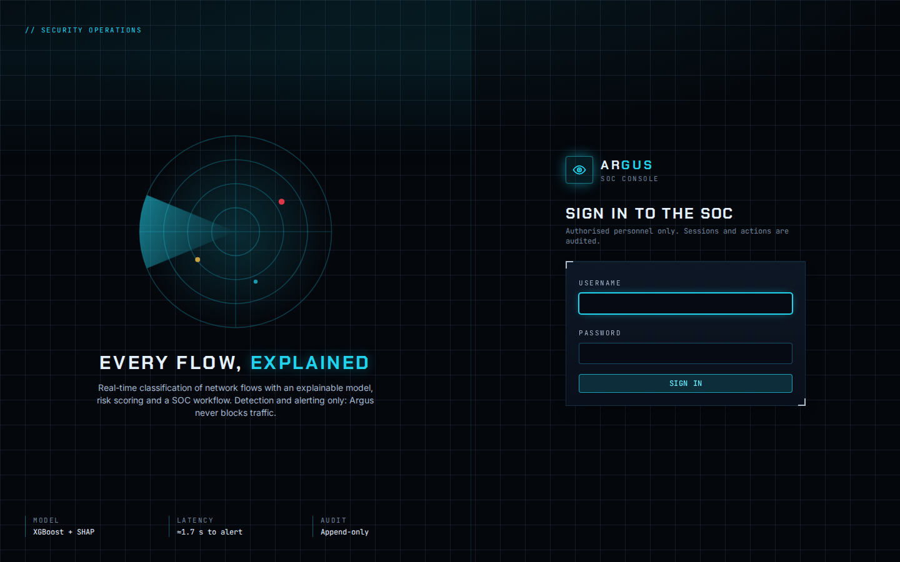
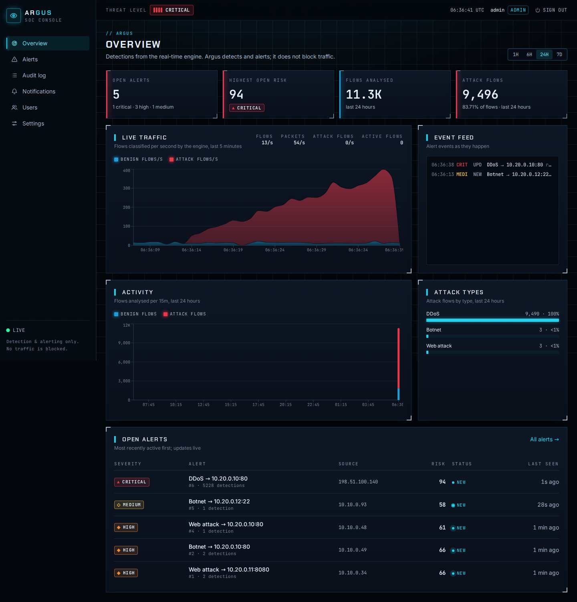
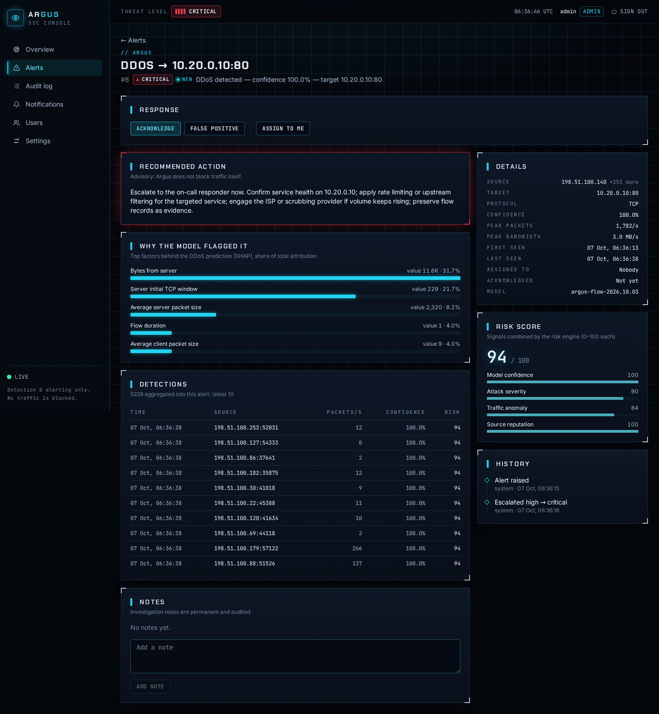
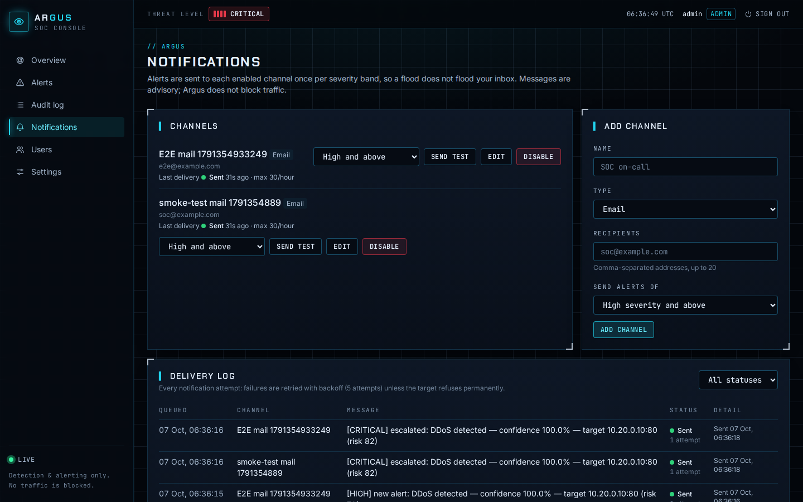
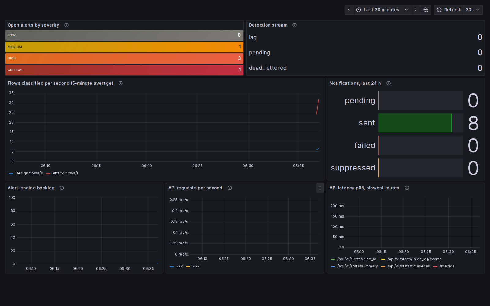

# Demo walkthrough

A ten-minute tour from a fresh clone. Everything runs locally; the simulator
sends nothing on any network.

## 1. Start

```bash
git clone https://github.com/GoDZi6999/DDoS-System.git && cd DDoS-System
docker compose up --build -d --wait          # first build takes a few minutes
docker compose logs migrate                  # the generated admin password, shown once
```

Open <http://localhost:3000> and sign in as `admin`. (Lost the password?
`docker compose exec backend python -m app.cli reset-password admin`.)



## 2. Normal traffic

The **Overview** is a SOC console: the threat level (highest open severity)
and a UTC clock in the top bar, a terminal-style *Event feed* of alert events
as they happen, and the engine classifying simulated lab traffic: about 15
benign flows per second on the *Live traffic* chart, KPI tiles for the last 24
hours, attack types and open alerts. A few low-confidence alerts may appear
over time: the model's ~0.2% false-positive rate on benign flows. Closing them
as *False positive* is part of the analyst workflow.

## 3. Launch an attack

```bash
docker compose exec engine python -m argus_engine inject --scenario ddos --duration 30
```

Within two seconds the red *Attack flows/s* area climbs on the live chart, the
*Open alerts* tile goes up and a **Critical DDoS** alert for `10.20.0.10:80`
appears at the top of the list, without reloading. One alert absorbs the
whole flood (thousands of detections) and escalates as the risk rises.



Other scenarios: `dos`, `portscan` (packet-level probes caught by the window
rule), `bruteforce`, `webattack`, `botnet`. For a looping story, run
`ENGINE_SCENARIO=demo docker compose up -d engine`.

## 4. Investigate

Open the alert:

- **Why the model flagged it**: the SHAP factors in plain language (for a DDoS:
  bytes from the server, the server's initial TCP window, packet sizes).
- **Risk score**: the four signals (model confidence, traffic anomaly, attack
  severity, source reputation) and the total.
- **Recommended action**: advisory text. Argus detects and alerts; it
  does not block traffic.
- **Detections**: the latest flows aggregated into the alert.



Work it: **Acknowledge**, **Assign to me**, add a note, **Mark contained**,
**Resolve**. Every step lands in *History* and in the **Audit log**
(admins), which the database itself keeps append-only.

## 5. Notifications

Under **Notifications** (admins), add a channel: an email list, a Slack
incoming webhook or a signed webhook. Pick a minimum severity and press
*Send test*. To see email without a mail server, restart with the bundled
mail catcher and open <http://localhost:8025>:

```bash
COMPOSE_PROFILES=mail SMTP_HOST=mailpit SMTP_PORT=1025 SMTP_SECURITY=none \
  docker compose up -d --wait
```

Inject another attack: the channel gets one message when the alert is
raised and one per escalation, however long the flood lasts.



## 6. Settings, users, roles

- **Settings**: alert threshold, aggregation window and risk weights. Admins
  edit, analysts read; changes reach the engine within seconds and are
  audited. Everyone can change their own password.
- **Users**: create an *analyst* (works alerts) or *viewer* (read-only) and
  sign in as them in a private window to see the role differences.

## 7. Operations (optional)

```bash
COMPOSE_PROFILES=monitoring docker compose up -d --wait
```

Grafana at <http://localhost:3001> (user `admin`, password
`GRAFANA_ADMIN_PASSWORD`, default `change-me-grafana`) shows open alerts,
flows per second, the alert engine's backlog, notification outcomes and API
latency.



## 8. Replay your own capture

```bash
docker compose cp capture.pcap engine:/tmp/capture.pcap
docker compose exec engine python -m argus_engine run --source pcap --pcap /tmp/capture.pcap
```

See [`engine/README.md`](../engine/README.md) for live capture (needs
`CAP_NET_RAW` on a host interface) and what to expect from traffic that does
not look like the training data.

## 9. Clean up

```bash
docker compose down          # keep data
docker compose down -v       # also delete the database, Redis and monitoring volumes
```
