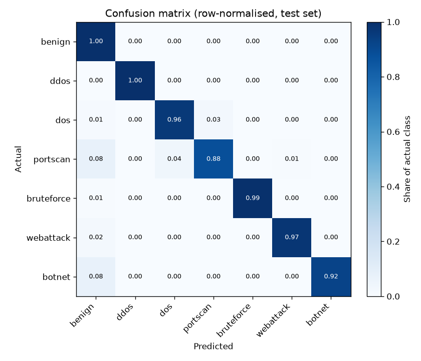
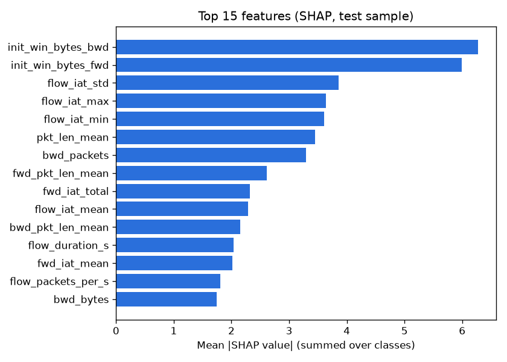

# Model report — argus-flow 2026.10.03

Selected model: **xgboost** (by cross-validated macro-F1). Trained 2026-10-03T17:07:15 UTC in 5.9 min, commit `fdebf0c873`.

## Data

CIC-IDS2017 MachineLearningCVE, 8 files (sha256 `877840ea5812eab3…`).

| Step | Rows |
|---|---:|
| Loaded | 2,830,743 |
| Dropped: classes too rare to learn (Infiltration, Heartbleed) | 47 |
| Dropped: negative flow duration (CICFlowMeter bug) | 115 |
| Dropped: exact duplicates | 653,453 |
| Dropped: identical features with conflicting labels | 810 |
| **Kept** | **2,176,318** |

Split: temporal 70/30 per (file, label) group — the later part of every attack run is held out, so near-identical consecutive flows cannot leak from training into test. Training used at most 150,000 rows per class (385,233 of 1,523,414); the test set is used in full.

| Class | Train (used) | Test |
|---|---:|---:|
| benign | 150,000 | 552,084 |
| ddos | 89,609 | 38,404 |
| dos | 135,446 | 58,050 |
| portscan | 1,295 | 556 |
| bruteforce | 6,404 | 2,745 |
| webattack | 1,499 | 644 |
| botnet | 980 | 421 |

## Model comparison

| Model | CV macro-F1 | Test macro-F1 | Test accuracy | ROC-AUC (OvR) | PR-AUC | Attack detection | False positives | Latency (1 flow) | Fit |
|---|---:|---:|---:|---:|---:|---:|---:|---:|---:|
| logistic_regression | 0.8837 ± 0.0173 | 0.4632 | 85.75% | 0.9899 | 0.6976 | 96.90% | 15.22% | 0.71 ms | 72 s |
| random_forest | 0.9793 ± 0.0131 | 0.7689 | 98.95% | 0.9939 | 0.8474 | 98.36% | 0.69% | 37.26 ms | 21 s |
| xgboost ✅ | 0.9849 ± 0.0125 | 0.8276 | 99.48% | 0.9995 | 0.9003 | 99.27% | 0.20% | 1.24 ms | 39 s |

*Attack detection*: share of attack flows flagged as any attack. *False positives*: share of benign flows flagged as an attack.

## Per-class results (xgboost, test set)

| Class | Precision | Recall | F1 | Support |
|---|---:|---:|---:|---:|
| benign | 0.9987 | 0.9980 | 0.9983 | 552,084 |
| ddos | 0.9998 | 0.9991 | 0.9994 | 38,404 |
| dos | 0.9933 | 0.9630 | 0.9779 | 58,050 |
| portscan | 0.2377 | 0.8795 | 0.3743 | 556 |
| bruteforce | 0.9982 | 0.9945 | 0.9964 | 2,745 |
| webattack | 0.7917 | 0.9736 | 0.8733 | 644 |
| botnet | 0.4156 | 0.9240 | 0.5733 | 421 |

## What drives the predictions

Mean absolute SHAP value per feature on a stratified test sample:

| Feature | Mean \|SHAP\| |
|---|---:|
| `init_win_bytes_bwd` | 6.2746 |
| `init_win_bytes_fwd` | 5.9928 |
| `flow_iat_std` | 3.8595 |
| `flow_iat_max` | 3.6391 |
| `flow_iat_min` | 3.6054 |
| `pkt_len_mean` | 3.4489 |
| `bwd_packets` | 3.2958 |
| `fwd_pkt_len_mean` | 2.6085 |
| `fwd_iat_total` | 2.3215 |
| `flow_iat_mean` | 2.2885 |

## Caveats

- One dataset, one capture environment: these numbers measure how well the model separates CIC-IDS2017's traffic, not how it will do on another network. Expect lower scores on live traffic until it is validated there.
- CIC-IDS2017 has documented labelling and flow-construction errors (Engelen et al., 2021).
- Cross-validation runs on class-capped (balanced) data while the test set keeps the real mix (mostly benign), so rare-class precision is lower on test: even a 0.1% false-positive rate on hundreds of thousands of benign flows outnumbers a few hundred attack flows. The test numbers are the realistic ones.
- Port scans and botnet traffic are poorly separated per flow: deduplication shows most scan probes are feature-identical to each other and close to short benign flows. They are patterns across flows (one source, many ports or hosts), which needs the window-level features planned for the real-time engine (Phase 5).
- TCP initial window sizes rank highest; they partly reflect the operating systems in the CIC testbed and may not transfer to other networks (an ablation without them is a planned check).
- Rare classes (botnet, web attacks) have few test flows, so their scores are noisy.
- Port numbers are deliberately not used as features, to stop the model learning "port 80 = attack" shortcuts specific to this dataset.
- SHAP explains the model's reasoning, not ground-truth causality.
