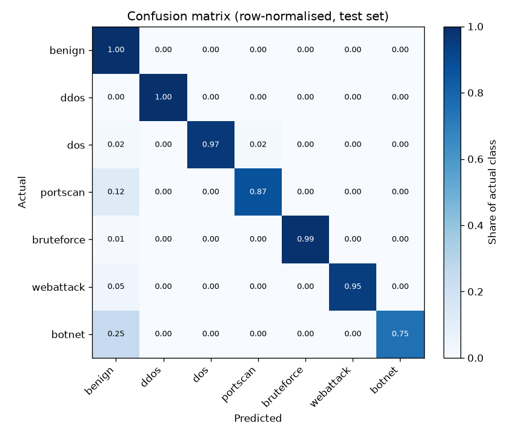
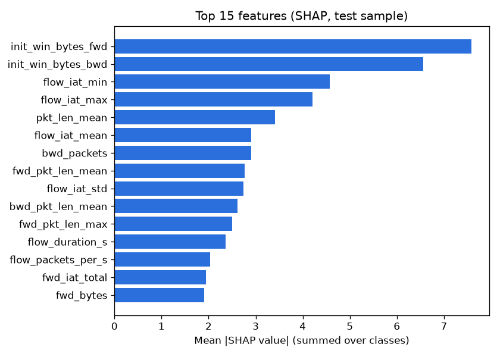

# Model report — sentinel-flow 2026.10.04

Selected model: **xgboost** (by validation macro-F1 after decision tuning). Trained 2026-10-04T11:24:28 UTC in 13.9 min, commit `f798b92660`.

## Headline (test set, shipped model)

| | Macro-F1 | Accuracy | Attack detection | False positives | Calibration error |
|---|---:|---:|---:|---:|---:|
| Shipped (argmax) | 0.8530 | 99.56% | 98.72% | 0.11% | 0.0030 |

*Attack detection*: share of attack flows flagged as any attack. *False positives*: share of benign flows flagged as an attack. *Calibration error*: expected calibration error of the reported confidence (0 = confidence matches accuracy).

## Data

CIC-IDS2017 MachineLearningCVE, 8 files (sha256 `877840ea5812eab3…`).

| Step | Rows |
|---|---:|
| Loaded | 2,830,743 |
| Dropped: classes too rare to learn (Infiltration, Heartbleed) | 47 |
| Dropped: negative flow duration (CICFlowMeter bug) | 115 |
| Dropped: exact duplicates | 653,453 |
| Dropped: identical features with conflicting labels | 810 |
| **Kept** | **2,176,318** |

Split: temporal 70/30 per (file, label) group: the later part of every attack run is held out, so near-identical consecutive flows cannot leak into the test set. Validation: last 20% of each group's training part, real class mix (304,674 rows). Training kept every benign flow and at most 150,000 flows per attack class (1,523,414 of 1,523,414); the test set is used in full.

| Class | Train (used) | Test |
|---|---:|---:|
| benign | 1,288,181 | 552,084 |
| ddos | 89,609 | 38,404 |
| dos | 135,446 | 58,050 |
| portscan | 1,295 | 556 |
| bruteforce | 6,404 | 2,745 |
| webattack | 1,499 | 644 |
| botnet | 980 | 421 |

## Model comparison

Each candidate is fitted without the validation part, scored on it, and gets its own decision weights. Test scores in this table come from these validation-stage models; the shipped model is the selected candidate refitted on the whole training split.

| Model | Validation macro-F1 (argmax → tuned) | Test macro-F1 | ROC-AUC (OvR) | PR-AUC | Attack detection | False positives | Latency (1 flow) | Fit |
|---|---:|---:|---:|---:|---:|---:|---:|---:|
| logistic_regression | 0.5052 → 0.5932 | 0.5351 | 0.9563 | 0.6356 | 94.75% | 7.02% | 0.54 ms | 196 s |
| random_forest | 0.8614 → 0.9211 | 0.7670 | 0.9201 | 0.8245 | 96.33% | 0.14% | 25.77 ms | 113 s |
| xgboost ✅ | 0.9383 → 0.9437 | 0.7674 | 0.9928 | 0.8276 | 98.12% | 0.08% | 1.33 ms | 134 s |

## Per-class results (xgboost, shipped, test set)

| Class | Precision | Recall | F1 | Support | Decision weight |
|---|---:|---:|---:|---:|---:|
| benign | 0.9977 | 0.9989 | 0.9983 | 552,084 | 1.000 |
| ddos | 0.9998 | 0.9986 | 0.9992 | 38,404 | 1.000 |
| dos | 0.9963 | 0.9659 | 0.9809 | 58,050 | 1.000 |
| portscan | 0.3329 | 0.8705 | 0.4816 | 556 | 1.000 |
| bruteforce | 0.9989 | 0.9913 | 0.9951 | 2,745 | 1.000 |
| webattack | 0.8590 | 0.9457 | 0.9002 | 644 | 1.000 |
| botnet | 0.5205 | 0.7530 | 0.6155 | 421 | 1.000 |

A decision weight below 1 makes the model more conservative about that class: the label is argmax(probability x weight), so a class with weight 0.1 must be about ten times more likely than benign before it is reported.

## Ablation: without TCP initial window sizes

Same model and procedure without `init_win_bytes_fwd`, `init_win_bytes_bwd`, which rank high and partly reflect the testbed's operating systems.

| Variant | Validation macro-F1 (argmax → tuned) | Test macro-F1 | False positives |
|---|---:|---:|---:|
| All features (validation-stage) | 0.9383 → 0.9437 | 0.7674 | 0.08% |
| Without window sizes | 0.8239 → 0.9201 | 0.7491 | 0.09% |

## What drives the predictions

Mean absolute SHAP value per feature on a stratified test sample:

| Feature | Mean \|SHAP\| |
|---|---:|
| `init_win_bytes_fwd` | 7.5834 |
| `init_win_bytes_bwd` | 6.5629 |
| `flow_iat_min` | 4.5728 |
| `flow_iat_max` | 4.2109 |
| `pkt_len_mean` | 3.4156 |
| `flow_iat_mean` | 2.9059 |
| `bwd_packets` | 2.8990 |
| `fwd_pkt_len_mean` | 2.7698 |
| `flow_iat_std` | 2.7413 |
| `bwd_pkt_len_mean` | 2.6183 |

## Caveats

- One dataset, one capture environment: these numbers measure how well the model separates CIC-IDS2017's traffic, not how it will do on another network.
- CIC-IDS2017 has documented labelling and flow-construction errors (Engelen et al., 2021).
- Validation and test come from different parts of each attack run; where an attack changes over its run (port scans most of all), validation scores are optimistic and the test scores are the realistic ones.
- Port scans and botnet traffic are poorly separated per flow; the real-time engine adds a window rule for scans.
- Port numbers are deliberately not features, to avoid "port 80 = attack" shortcuts.
- SHAP explains the model's reasoning, not ground-truth causality.
