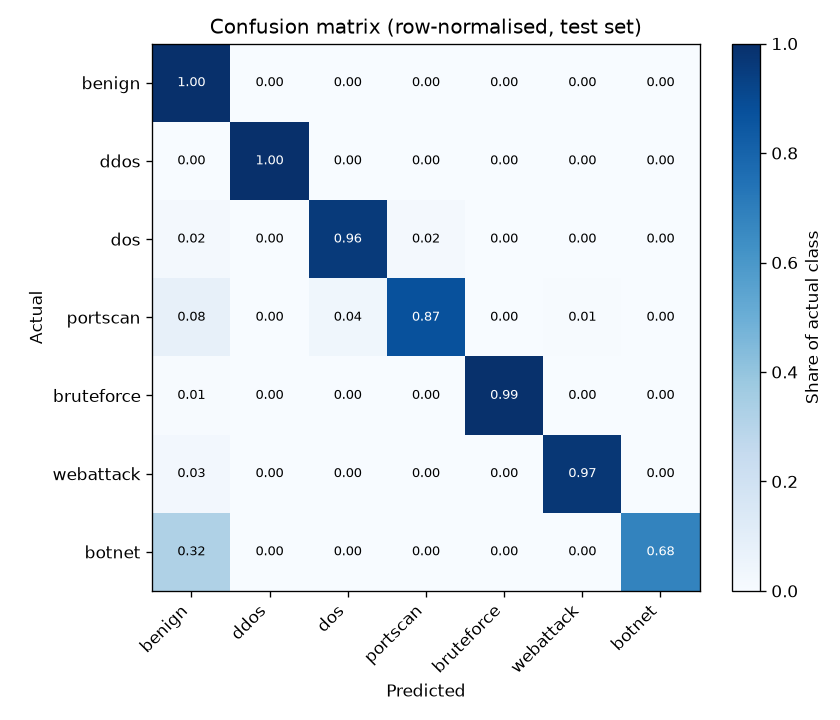
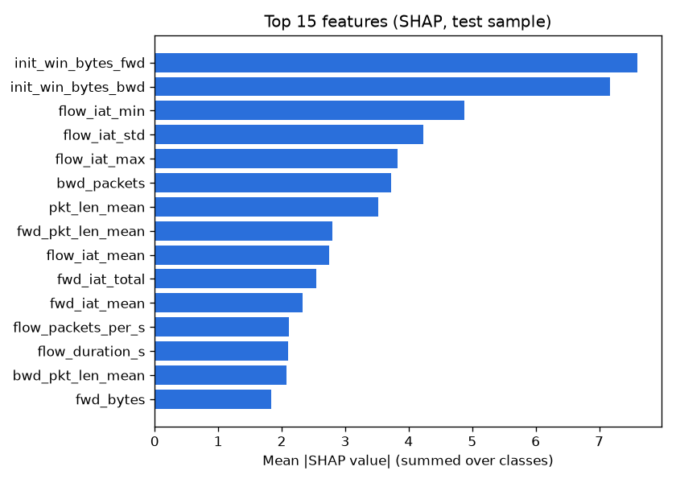

# Model report — sentinel-flow 2026.10.08

Selected model: **xgboost** (highest validation macro-F1 (argmax)). Trained 2026-10-08T19:42:44 UTC in 29.6 min, commit `ea579289cd`.

## Headline (test set, shipped model)

| | Macro-F1 | Accuracy | Attack detection | False positives | Calibration error |
|---|---:|---:|---:|---:|---:|
| Shipped (argmax) | 0.8410 | 99.48% | 98.55% | 0.14% | 0.0037 |

*Attack detection*: share of attack flows flagged as any attack. *False positives*: share of benign flows flagged as an attack. *Calibration error*: expected calibration error of the reported confidence (0 = confidence matches accuracy).

## Release gate vs 2026.10.03: **failed**

Fixed before evaluation (`sentinel_ml/gate.py`): strictly fewer false positives, and no class losing more than 10 points of recall.

| Check | This model | Reference | Result |
|---|---:|---:|---|
| false_positive_rate | 0.14% | 0.20% | pass |
| recall_benign | 0.9986 | 0.9980 | pass |
| recall_ddos | 0.9987 | 0.9991 | pass |
| recall_dos | 0.9596 | 0.9630 | pass |
| recall_portscan | 0.8741 | 0.8795 | pass |
| recall_bruteforce | 0.9945 | 0.9945 | pass |
| recall_webattack | 0.9705 | 0.9736 | pass |
| recall_botnet | 0.6770 | 0.9240 | FAIL |

## Data

CIC-IDS2017 MachineLearningCVE, 8 files (sha256 `877840ea5812eab3…`).

| Step | Rows |
|---|---:|
| Loaded | 2,830,743 |
| Dropped: classes too rare to learn (Infiltration, Heartbleed) | 47 |
| Dropped: negative flow duration (CICFlowMeter bug) | 115 |
| Dropped: exact duplicates | 653,453 |
| Dropped: identical features with conflicting labels | 810 |
| **Kept** | **2,176,318** |

Split: temporal 70/30 per (file, label) group: the later part of every attack run is held out, so near-identical consecutive flows cannot leak into the test set. Validation: last 20% of each group's training part, real class mix (304,674 rows). Training kept every benign flow and at most 150,000 flows per attack class (1,523,414 of 1,523,414); the test set is used in full.

| Class | Train (used) | Test |
|---|---:|---:|
| benign | 1,288,181 | 552,084 |
| ddos | 89,609 | 38,404 |
| dos | 135,446 | 58,050 |
| portscan | 1,295 | 556 |
| bruteforce | 6,404 | 2,745 |
| webattack | 1,499 | 644 |
| botnet | 980 | 421 |

## Model comparison

Each candidate is fitted without the validation part, scored on it, and gets its own decision weights. Test scores in this table come from these validation-stage models; the shipped model is the selected candidate refitted on the whole training split.

| Model | Validation macro-F1 (argmax → tuned) | Test macro-F1 | ROC-AUC (OvR) | PR-AUC | Attack detection | False positives | Latency (1 flow) | Fit |
|---|---:|---:|---:|---:|---:|---:|---:|---:|
| logistic_regression | 0.5043 → 0.5921 | 0.5358 | 0.9570 | 0.6379 | 94.79% | 7.13% | 0.75 ms | 182 s |
| random_forest | 0.8614 → 0.9211 | 0.7670 | 0.9201 | 0.8245 | 96.33% | 0.14% | 31.19 ms | 73 s |
| xgboost ✅ | 0.9391 → 0.9493 | 0.7704 | 0.9929 | 0.8302 | 98.24% | 0.09% | 7.47 ms | 431 s |

## Per-class results (xgboost, shipped, test set)

| Class | Precision | Recall | F1 | Support | Decision weight |
|---|---:|---:|---:|---:|---:|
| benign | 0.9974 | 0.9986 | 0.9980 | 552,084 | 1.000 |
| ddos | 0.9996 | 0.9987 | 0.9992 | 38,404 | 1.000 |
| dos | 0.9936 | 0.9596 | 0.9763 | 58,050 | 1.000 |
| portscan | 0.2994 | 0.8741 | 0.4461 | 556 | 1.000 |
| bruteforce | 0.9993 | 0.9945 | 0.9969 | 2,745 | 1.000 |
| webattack | 0.8693 | 0.9705 | 0.9171 | 644 | 1.000 |
| botnet | 0.4680 | 0.6770 | 0.5534 | 421 | 1.000 |

A decision weight below 1 makes the model more conservative about that class: the label is argmax(probability x weight), so a class with weight 0.1 must be about ten times more likely than benign before it is reported.

## Ablation: without TCP initial window sizes

Same model and procedure without `init_win_bytes_fwd`, `init_win_bytes_bwd`, which rank high and partly reflect the testbed's operating systems.

| Variant | Validation macro-F1 (argmax → tuned) | Test macro-F1 | False positives |
|---|---:|---:|---:|
| All features (validation-stage) | 0.9391 → 0.9493 | 0.7704 | 0.09% |
| Without window sizes | 0.6510 → 0.7038 | 0.5807 | 5.14% |

## What drives the predictions

Mean absolute SHAP value per feature on a stratified test sample:

| Feature | Mean \|SHAP\| |
|---|---:|
| `init_win_bytes_fwd` | 7.6006 |
| `init_win_bytes_bwd` | 7.1717 |
| `flow_iat_min` | 4.8743 |
| `flow_iat_std` | 4.2320 |
| `flow_iat_max` | 3.8176 |
| `bwd_packets` | 3.7185 |
| `pkt_len_mean` | 3.5254 |
| `fwd_pkt_len_mean` | 2.7943 |
| `flow_iat_mean` | 2.7431 |
| `fwd_iat_total` | 2.5416 |

## Caveats

- One dataset, one capture environment: these numbers measure how well the model separates CIC-IDS2017's traffic, not how it will do on another network.
- CIC-IDS2017 has documented labelling and flow-construction errors (Engelen et al., 2021).
- Validation and test come from different parts of each attack run; where an attack changes over its run (port scans most of all), validation scores are optimistic and the test scores are the realistic ones.
- Port scans and botnet traffic are poorly separated per flow; the real-time engine adds a window rule for scans.
- Port numbers are deliberately not features, to avoid "port 80 = attack" shortcuts.
- SHAP explains the model's reasoning, not ground-truth causality.
